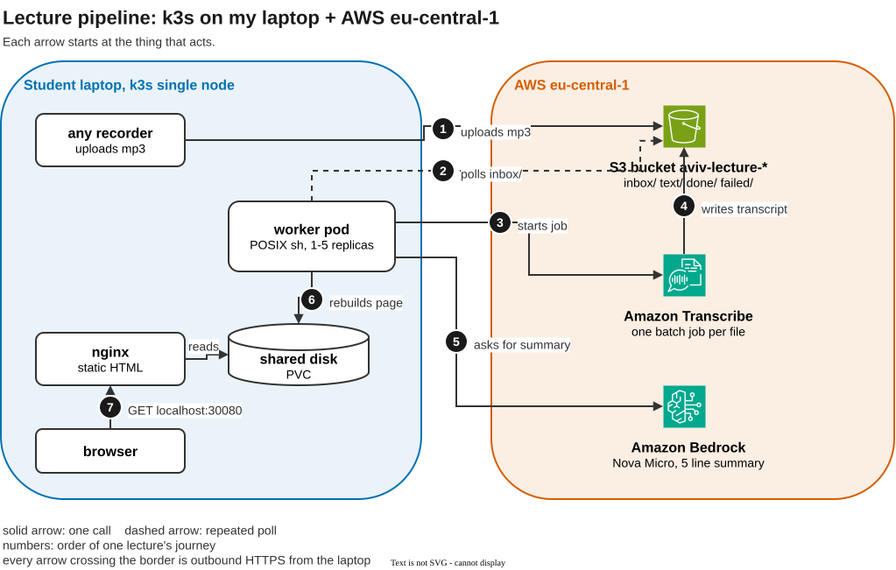

# The lecture writes its own notes

Record a lecture, drop it in a bucket, and a few minutes later a web page on your machine has the full transcript and a short summary. AWS does the listening, your machine keeps the library.



## What it is
I take lecture notes in my second language (ENG), and listening while writing does not work. So this project does the writing. You upload a recording, AWS Transcribe turns it into text, Bedrock writes a five-points summary, and a small worker on my k3s cluster builds one static page with every lecture. nginx serves it on localhost.

The idea in one sentence: AWS is the brain, k3s is the production floor. I buy the part that would take a year to build, and I own the part that has to keep running.

## What you need

- an AWS account with the CLI configured (`aws configure`), with rights to create an S3 bucket and an IAM user
- Terraform
- a Kubernetes cluster with kubectl pointing at it (I use k3s). It needs a default StorageClass, which k3s, kind and minikube all have already

Everything is created in eu-central-1, and one AWS account holds one copy. With a cluster already running this takes 30 to 60 minutes. If summaries do not appear, enable the Amazon Nova models once in the Bedrock console.

## How to run it

```
git clone https://github.com/Aviv1001/final_project.git
cd final_project
./install.sh
```

The script builds the AWS side with Terraform (one S3 bucket and one IAM user that can only touch this bucket, Transcribe and Bedrock), applies the Kubernetes manifest, and passes the bucket name and the key to the pods. It waits until both deployments are ready and prints the address. It's idempotent, so running it again is safe.

Then upload a recording. Ask Terraform for your bucket name, then copy the file in:

```
BUCKET=$(terraform -chdir=terraform output -raw bucket)
aws s3 cp lecture.mp3 "s3://$BUCKET/inbox/2026-09-03-history-lecture.mp3"
```

Or open the bucket in the S3 console and drag a file into `inbox/`. The worker watches the folder and does not care how the file got there.

Give every upload a fresh name, starting with the date works well. Transcribe keeps a job name for 90 days, so a file you retry needs a new name. Names can use letters, digits, dots, dashes and underscores. Transcribe accepts mp3, m4a, mp4, wav and more.

Open http://localhost:30080/ and wait. A short clip appears in about a minute.

On k3s the node is your own machine, so that address just works. On kind or minikube it does not. Open a tunnel first, then use the same address:

```
kubectl -n lectures port-forward svc/web 30080:8080
```

## How it works

The numbers match the arrows in the diagram.

1. You upload a recording to `inbox/`.
2. A worker pod polls the inbox every fifteen seconds.
3. It starts a transcription job. The job name is the file name, and AWS refuses a second job with the same name, so five workers can share one inbox and never do the same file twice. S3 is the queue, and the job name is the lock.
4. Transcribe writes the transcript back into the bucket.
5. The worker asks Bedrock for a five line summary.
6. It rebuilds one static page on the shared volume, and nginx serves it read only. The audio moves to `done/`, and a file that fails for an hour moves to `failed/`.
7. You open http://localhost:30080/.

## Scaling

One worker is enough for one person. When five lectures arrive at once:

```
kubectl -n lectures scale deployment/worker --replicas=5
```

Five workers share the inbox with no extra code, because the job name lock is enforced by AWS. Scale back with `--replicas=1`.

## What it costs

Measured, not estimated. Transcribe is $0.006 per minute, so a 90 minute lecture is about 54 cents, and the first 60 minutes each month are free for the first year. A summary costs $0.00017. A 21 minute test transcribed in 79 seconds with 98 percent accuracy.

## CI

Every pull request builds the image and checks the scripts. A merge to main also publishes the image to ghcr, tagged `v1` and with the commit hash. The cluster pulls the published image, so nothing is built on your machine.

## Removing it

```
terraform -chdir=terraform destroy
```

The bucket empties itself first, so one command removes everything Terraform created. Delete the namespace with `kubectl delete namespace lectures` and the cluster is clean too.
